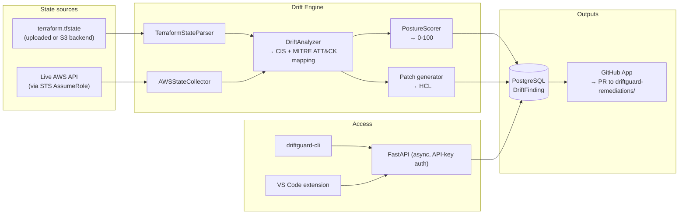

# DriftGuard

[](https://github.com/EdwinJdevops/driftguard/actions/workflows/ci.yml)
[](LICENSE)
[](requirements.txt)
[](#contributing)

**Terraform drift detection and remediation.** Compares `terraform.tfstate` against live AWS state, scores every discrepancy against CIS AWS Benchmarks and MITRE ATT&CK, prices the monthly cost delta, and opens a GitHub PR with a suggested Terraform patch — for a human to review, not to auto-merge.

**[▶ Interactive demo](demo/index.html)** · **[CLI](cli/README.md)** · **[VS Code extension](vscode-extension/README.md)** · **[API docs](#api)**

---

## The problem

Terraform state describes what your infrastructure *should* look like. It does not verify your infrastructure still looks like that. A security group rule changed through the console, an S3 bucket with encryption disabled mid-incident, an RDS instance flipped to publicly accessible — none of it shows up in `terraform plan` unless someone re-applies against the same resource. Most teams find out during an audit, or after an incident.

DriftGuard checks continuously instead, and turns every finding into a reviewable PR.

## Architecture



Scans run as FastAPI background tasks in their own DB transaction — this matters: a background task opens its own session and will not see uncommitted data from the request that triggered it, so the request path commits explicitly before dispatch (see `backend/api/main.py`).

## Security model

Two credential problems come up in any tool that touches a customer's AWS account and GitHub repo. Both are handled the same way — short-lived, scoped, per-tenant identity, never a static secret with broad access:

| | Naive approach (rejected) | What DriftGuard does |
|---|---|---|
| **AWS access** | Accept `aws_access_key_id`/`secret` over HTTP | [STS AssumeRole](backend/integrations/aws_auth.py) with a per-workspace external ID (confused-deputy guarded — DriftGuard actively probes that a role rejects the wrong external ID before trusting it) |
| **GitHub access** | One static PAT with access to every customer's repo | [GitHub App installation tokens](backend/integrations/github_pr.py) — JWT-signed, scoped only to repos that installed the app, expire in ~1 hour |

Self-hosted single-account deployments can skip the AssumeRole flow entirely — DriftGuard falls back to the ambient credential chain (an IAM role already attached to wherever it's running).

## What it does not do

- Does not modify your infrastructure directly. It reads AWS state and Terraform state; nothing is written to either.
- Does not auto-apply patches or splice them into your existing `.tf` files — that's an HCL-aware-parsing problem, and getting it wrong silently corrupts real infrastructure code. Patches land as new files under `driftguard-remediations/` in a PR, for human review.
- Does not support multi-cloud yet. AWS only — Azure and GCP collectors aren't built.
- Is not a replacement for `terraform plan`. Plan tells you what *will* change. DriftGuard tells you what already changed outside your control.

## Resource coverage

| Resource | Tracked attributes |
|---|---|
| `aws_instance` | instance_type, vpc_security_group_ids, iam_instance_profile |
| `aws_s3_bucket` | versioning, server_side_encryption_configuration, acl |
| `aws_security_group` | ingress, egress |
| `aws_db_instance` | instance_class, publicly_accessible, storage_encrypted |
| `aws_iam_role` | assume_role_policy |
| `aws_iam_policy` | policy document |

Extending coverage means adding a method to `AWSStateCollector` and a rule entry to `SECURITY_RULES` in `backend/engines/drift.py`.

## Quick start

### Run the engine locally — no AWS account needed

```bash
git clone https://github.com/EdwinJdevops/driftguard.git
cd driftguard
pip install -r requirements-dev.txt
pytest backend/tests/ -v
```

45 tests, synthetic state and `moto`-mocked AWS/STS — nothing leaves your machine, no credentials required.

### Full API + dashboard

```bash
pip install -r requirements.txt
uvicorn backend.api.main:app --reload
```

API at `http://localhost:8000`, interactive docs at `/docs`. Defaults to SQLite if `DATABASE_URL` is unset — fine for testing, not for a deployed instance (most free hosts wipe the filesystem on restart). Use Postgres in production (Render's free tier expires after 90 days; Neon has no expiry on its free tier).

```bash
cd frontend
npm install
npm run dev   # http://localhost:5173, proxies to the API via VITE_API_URL
```

Real React app (Vite + TS + Tailwind v4) — landing page plus a dashboard wired to the live API (workspaces, scan trigger + poll, findings, posture score). Not mock data.

### Deploy — Render

```bash
git push
# In the Render dashboard: New > Blueprint, point at this repo, it reads render.yaml
```

`render.yaml` provisions both services plus a free Postgres instance, and wires `ALLOWED_ORIGINS` / `VITE_API_URL` between them automatically via `fromService` + `RENDER_EXTERNAL_HOSTNAME` (Render doesn't support variable interpolation in `render.yaml` directly, so the scheme is prepended via shell interpolation in the build/start commands — same pattern Render's own examples use). You'll be prompted for `GITHUB_APP_ID`, `GITHUB_APP_PRIVATE_KEY`, and `DRIFTGUARD_AWS_ACCOUNT_ID` on first deploy (`sync: false` — secrets aren't stored in the Blueprint file).

Validate the Blueprint before deploying, if you have the Render CLI: `render blueprints validate render.yaml`.

### CLI

```bash
pip install -e ./cli   # not yet on PyPI
driftguard signup --org-name "Acme" --org-slug acme
driftguard workspace create prod --region us-east-1
driftguard scan trigger <workspace-id> --wait
```

Full command reference: [cli/README.md](cli/README.md).

### VS Code extension

Findings sidebar, one-click scan triggers, jump straight to a remediation PR. Built and type-checked; not yet published to the Marketplace. Package it locally:

```bash
cd vscode-extension
npm install && npx @vscode/vsce package
# Install the resulting .vsix via "Extensions: Install from VSIX..." in VS Code
```

Details: [vscode-extension/README.md](vscode-extension/README.md).

## API

Every authenticated route expects `Authorization: Bearer dg_live_...`.

```bash
curl -X POST $API/signup -d '{"org_name": "Acme", "org_slug": "acme"}'

curl -X POST $API/workspaces -H "Authorization: Bearer $KEY" \
  -d '{"name": "production", "region": "us-east-1"}'

curl -X POST $API/workspaces/$WS_ID/scan -H "Authorization: Bearer $KEY" \
  -d @terraform.tfstate

curl $API/scans/$SCAN_ID -H "Authorization: Bearer $KEY"
```

Full schema at `/docs`.

## Known limitations

Stated plainly, not buried:

- **Scheduling isn't enforced.** `scan_interval_minutes` is stored on a workspace but nothing dispatches on it — scans are triggered manually or via API/CLI/extension today. Celery is a listed dependency with an empty `workers/` package; wiring it up is the next real gap, not a hidden one.
- **Cross-account AssumeRole flow is built and unit-tested, not live-validated** — it needs a real AWS account acting as the trusted principal, which isn't provisioned yet. Self-hosted single-account mode (ambient credentials) is the supported path today.
- **No Alembic migrations.** `init_db()` runs `Base.metadata.create_all`. Fine pre-launch; a real gap once there's production data to migrate around.
- **No multi-tenant load testing.** Built for correctness, not yet load-tested under concurrent orgs/workspaces.
- **Render's free Postgres tier expires after 90 days.** `render.yaml` provisions it because it's zero-friction for a first deploy — swap `DATABASE_URL` for Neon/Supabase before that matters.

## Testing

```bash
pytest backend/tests/ -v    # 50 tests: drift engine, AWS auth (STS + confused-deputy), GitHub PR automation, CORS
cd cli && pytest tests/ -v  # 5 CLI client tests
cd frontend && npx tsc -b && npm run build && npx oxlint  # type-check, build, lint
```

CI gates on all of it — `ruff check backend/` (no `--exit-zero`), the full pytest suite, the CLI suite, and a VS Code extension `tsc` build. A red check actually blocks merge.


GitHub PR automation tests use `httpx.MockTransport` — real request routing and serialization, only the socket is faked, so a wrong URL or method fails the test rather than being silently accepted. AWS auth tests mix `moto` (mechanics) with direct `ClientError` mocking for the confused-deputy check specifically, because `moto` doesn't enforce IAM trust-policy conditions and would otherwise give false confidence.

## Contributing

Issues and PRs welcome. If you're adding resource coverage, a new `AWSStateCollector` method plus a `SECURITY_RULES` entry and matching test in `backend/tests/test_drift_engine.py` is the expected shape of the change.

## License

MIT.

## Author

Edwin Jonathan Chibuike. Cloud and DevOps Engineer, Lagos, Nigeria.

[github.com/EdwinJdevops](https://github.com/EdwinJdevops) · [linkedin.com/in/edwin-jonathan-1094093b0](https://linkedin.com/in/edwin-jonathan-1094093b0)
